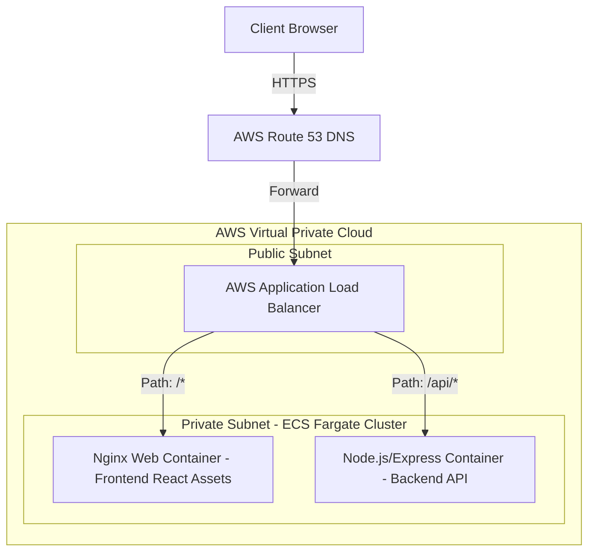
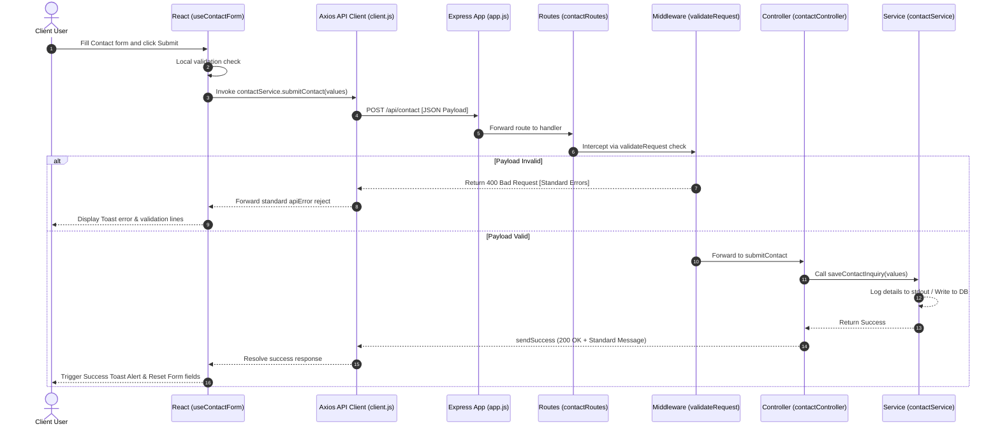

# TechFlow Landing Platform - Enterprise Architecture Blueprints

TechFlow is an enterprise-grade, full-stack application built to host responsive corporate landing pages and monitor real-time system health. 

This repository has been refactored into a scalable MVC (Model-View-Controller) architecture, decoupling frontend layouts, central API layers, services, controllers, validators, and custom error middleware. This structural design is prepared for isolated containerization (Docker) and cloud deployments (GitHub Actions + AWS).

---

## 📂 Project Directory Structure

```
d:\BProject\BlogeSite/
├── backend/                  # Node.js + Express REST API Engine
│   ├── config/               # Handles loading and validations of dotenv config files
│   │   └── env.js
│   ├── controllers/          # Triggers actions mapping routing paths to services
│   │   ├── contactController.js
│   │   └── healthController.js
│   ├── middleware/           # Express middleware interceptors
│   │   ├── errorHandler.js   # Centralized error mapping and reporting
│   │   └── validateRequest.js# Intercepts express-validation errors
│   ├── routes/               # Modular routing mappings
│   │   ├── api.js            # Base root router mapping subroutes
│   │   ├── contactRoutes.js
│   │   └── healthRoutes.js
│   ├── services/             # Core business logic processing files
│   │   ├── contactService.js
│   │   └── healthService.js  # Calculates uptime stats
│   ├── utils/                # Standard utilities
│   │   ├── asyncHandler.js   # Wrapper trapping async promise exceptions
│   │   └── responseHelper.js # Central helper for uniform API payloads
│   ├── validators/           # express-validator schema parameters
│   │   └── contactValidator.js
│   ├── app.js                # Express app framework initialization
│   ├── server.js             # Starts backend listener port
│   ├── .env.development      # Local development configurations
│   ├── .env.production       # Production configurations
│   ├── .env.example          # Environment template
│   └── package.json
│
└── frontend/                 # React 19 Client UI App
    ├── src/
    │   ├── api/
    │   │   └── client.js     # Axios client equipped with request & response interceptors
    │   ├── config/
    │   │   └── env.js        # Validates client VITE_API_URL parameters
    │   ├── services/         # Integrates REST API calls
    │   │   ├── contactService.js
    │   │   └── healthService.js
    │   ├── hooks/            # Custom reusable hooks
    │   │   ├── useApi.js     # Manages loading, data, and error state for calls
    │   │   ├── useContactForm.js
    │   │   └── useToast.js   # Invokes global Toast context notifications
    │   ├── contexts/
    │   │   └── ToastContext.jsx# Toast notification context provider
    │   ├── layouts/
    │   │   └── MainLayout.jsx# Global navigation wrapper
    │   ├── pages/            # Page view controllers
    │   │   ├── Home.jsx      # Aggregated landing sections
    │   │   └── SystemStatus.jsx# [NEW] Status monitoring dashboard
    │   ├── components/
    │   │   ├── common/       # Global UI assets
    │   │   │   ├── ErrorBoundary.jsx # Crashes recovery boundary
    │   │   │   ├── Navbar.jsx
    │   │   │   └── Footer.jsx
    │   │   ├── ui/           # Reusable feedback UI elements
    │   │   │   ├── Loader.jsx# Full page blur loader
    │   │   │   ├── Spinner.jsx# Inline ring spinners
    │   │   │   ├── EmptyState.jsx
    │   │   │   └── ErrorState.jsx # Local API failure recovery card
    │   │   └── sections/     # Reusable layout sections (Hero, FAQ, pricing, etc.)
    │   ├── utils/
    │   │   └── formatters.js # Math utilities (uptime formatting)
    │   ├── routes/
    │   │   └── AppRoutes.jsx # Route bindings
    │   ├── styles/
    │   │   └── custom.css    # Premium CSS design properties
    │   ├── App.jsx
    │   └── main.jsx
    ├── .env.development      # Local development api mappings
    ├── .env.production       # Production api mappings
    ├── .env.example          # Client variables template
    ├── index.html
    └── package.json
```

---

## 🏛️ System Architecture Diagram



---

## 🔄 API Sequence Request Flow



---

## ⚙️ Environment Strategy

We separate local development settings from staging/production configurations using distinct files for both frontend and backend directories:

### Development Environment
- **Files**: `backend/.env.development` and `frontend/.env.development`
- **Purpose**: Local debug parameters targeting localhost connections (`http://localhost:5000/api`).

### Production Environment
- **Files**: `backend/.env.production` and `frontend/.env.production`
- **Purpose**: Release settings targeting official production domains.

### How Loading Works
1. In the backend, `backend/config/env.js` reads `process.env.NODE_ENV` (defaults to `development`).
2. It constructs the file path (`.env.development` or `.env.production`) and loads it using `dotenv`.
3. It validates properties (e.g. confirming `PORT` is a valid number) before exporting configurations.

---

## 🐋 Future Docker Integration Notes

*(Prepared - Not implemented yet)*

To build container images in the next phase, we will write:
* **`backend/Dockerfile`**: Uses a lightweight Node base image, copies dependencies, exposes the PORT from configurations, and runs `node server.js`.
* **`frontend/Dockerfile`**: A multi-stage Docker build:
  - **Stage 1 (Compile)**: Installs node packages and builds React static resources.
  - **Stage 2 (Server)**: Loads Nginx to serve the generated static assets on port 80.
* **`docker-compose.yml`**: Ties both containers on a shared bridge network, enabling local multi-container testing.

---

## 🔄 Future GitHub Actions CI/CD Notes

*(Prepared - Not implemented yet)*

We will configure `.github/workflows/deploy.yml` to trigger on pushes to `main` and `develop` branches (conforming to `git_strategy.md` definitions):
1. **Lint and Test**: Validates backend and frontend JavaScript logic.
2. **Build and Tag**: Compiles optimized client resources, builds Docker images, and tags them.
3. **Registry Registry**: Logs into **AWS ECR** and pushes the new images.
4. **Deploy rolling update**: Instructs **AWS ECS** to pull the latest ECR image and perform zero-downtime rolling task updates.

---

## ☁️ Future AWS Deployment Notes

*(Prepared - Not implemented yet)*

* **Elastic Container Service (ECS) with AWS Fargate**: Serverless container orchestration. AWS manages underlying VM capacity, while containers scale up/down dynamically based on cpu/memory triggers.
* **AWS Application Load Balancer (ALB)**: A single gateway IP handling path routing. Routes `/api/*` paths directly to our private Express backend tasks, while general paths `/*` route to static Nginx tasks.
* **Amazon Route 53**: Directs domain queries safely to the ALB and handles HTTPS/SSL certificate handshakes.
