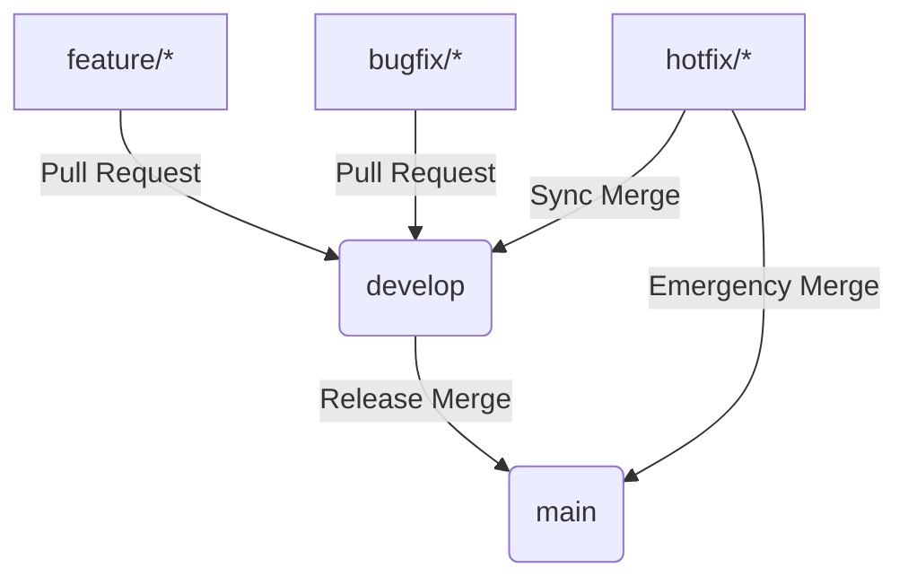

# TechFlow Git Branching Strategy & Workflow

To maintain code quality, release stability, and smooth continuous deployments, this project follows a structured branching model based on GitFlow principles.

---

## 🌿 Core Branches

### 1. `main` (Production Branch)
* **Purpose**: Serves as the official production branch. The code in `main` is always stable and ready for release.
* **Deployment**: Commits or merges to `main` trigger automated GitHub Actions to build Docker images and release to AWS ECS production tasks.
* **Rules**: 
  - Direct commits are **blocked**.
  - Merges must happen via pull requests (PR) originating from `develop` or a hotfix branch.
  - Requires passing automated test results and peer review approval.

### 2. `develop` (Integration Branch)
* **Purpose**: The integration branch for new features and bug fixes. It acts as the staging area before release.
* **Deployment**: Merges to `develop` trigger staging/testing pipeline builds.
* **Rules**:
  - Direct commits are **blocked**.
  - Merges must happen via pull requests originating from feature or bugfix branches.

---

## 🛠️ Supporting Branches

All developers work on short-lived supporting branches that branch off from and merge back into `develop` (or `main` in the case of hotfixes).

### 1. Feature Branches (`feature/*`)
* **Branch off**: `develop`
* **Merge back into**: `develop`
* **Naming Pattern**: `feature/feature-description` or `feature/ticket-number-description`
  - *Example*: `feature/system-status-dashboard`
* **Workflow**:
  1. Create a local branch: `git checkout -b feature/status-page develop`
  2. Implement features and commit locally.
  3. Push to remote: `git push origin feature/status-page`
  4. Open a Pull Request targeting `develop`.

### 2. Bugfix Branches (`bugfix/*`)
* **Branch off**: `develop`
* **Merge back into**: `develop`
* **Naming Pattern**: `bugfix/issue-description`
  - *Example*: `bugfix/toast-transition-overlap`
* **Workflow**: Used to resolve non-critical bugs found during integration testing or staging evaluations.

### 3. Hotfix Branches (`hotfix/*`)
* **Branch off**: `main`
* **Merge back into**: `main` and `develop`
* **Naming Pattern**: `hotfix/critical-issue-description`
  - *Example*: `hotfix/health-gateway-timeout`
* **Workflow**:
  - Reserved for resolving critical bugs found in production that require immediate fixing.
  - Branches off `main`, is tested, and then merged back into both `main` and `develop` to ensure the fix is carried forward.

---

## 🔄 Merging & Release Process

1. **Pull Request Validation**: Every PR targeting `develop` or `main` triggers lint and build tests automatically.
2. **Review Requirement**: At least 1 senior architect review is required to verify security configuration standards are met.
3. **Commit Cleanliness**: Developers should squash feature commits into clean singular units before merging to maintain clean history logs.
